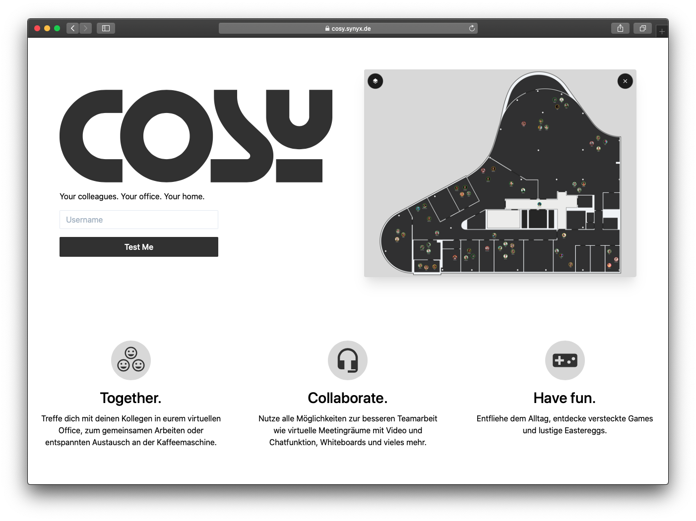

# cosy



Cosy ist als Gimmick für unser gemeinsames monatliches synyx Frühstück entstanden. In Zeiten der remote Arbeit
wollten wir im Mai 2020 das Gefühl schärfen "wieder vor Ort zu sein". Den Kollegen in __unserem__ Büro
auf dem Flur begegnen, sich in der Kaffee Ecke tummeln und sich unterhalten, oder eine Runde am Arcade zocken.

> Disclaimer:  
> Das Projekt wird aktuell nicht aktiv gepflegt. Cosy ist aus der Lust am Programmieren und am
> Lernen entstanden. Es wurden keine fertigen Spiele Engines verwendet und generell viel experimentiert.
> Für eine erste Demo hat es gereicht :-) 

## Run

```bash
npm run dev
```

Rufe dann die URL die dir gesagt wird im Browser auf (müsste `http://localhost:3000` sein).
Einloggen kannst du dich mit einem beliebigen Benutzernamen.

Um Jitsi als Videochat benutzen zu können musst du in der [server/routes/root.js](./src/server/routes/root.js) Datei
die URL zu deinem Jitsi Server eintragen. 

### Logging

Bibliotheken wie `koa-session` verwenden [debug] zum loggen.

Logging kann mit der `DEBUG` Umgebungsvariable aktiviert werden.  
Mehr Infos gibt es auf https://github.com/visionmedia/debug

> tldr;  
> `DEBUG=* node src/server/index.js`

Cosy loggt mit `console.log` auf _stdout_ und verwendet auch [debug] mit namespace `cosy` / `cosy:*`

## Development

Was du brauchst:

- NodeJS 12

Wie du startest:

- `npm install`: installiert alle benötigten Dependencies
- `npm run dev`: startet den Server und hört auf Änderungen im Code um ihn neu zu starten

Rufe dann die URL die dir gesagt wird im Browser auf (müsste `http://localhost:3000` sein).

Einloggen kannst du dich mit einem beliebigen Benutzernamen.

### VSCode Debug

Lege eine neue _run configuration_ an:

```
// ./vscode/launch.json
"configurations": [
	{
		"type": "node",
		"request": "launch",
		"name": "Launch Program [local]",
		"skipFiles": ["<node_internals>/**"],
		"program": "${workspaceFolder}/src/server/index.js",
		"env": {
			"DEBUG": "*",
			"NODE_ENV": "development"
		},
		"outputCapture": "std"
	}
]
```

* `env:DEBUG=*`: logge alles von Bibliotheken die [debug] nutzen
  * kann eingeschränkt werden mit z. B. `env:DEBUG=koa-route`. Dann wird nur `koa-route` geloggt
* `outputCapture:std`: [debug] loggt auf `stderr`. mit `outputCapture:std` wird alles in der _debug console_ von VSCode geloggt

## Lizenz

Lizensiert unter [Apache 2.0](./LICENSE)

[debug]: https://github.com/visionmedia/debug
