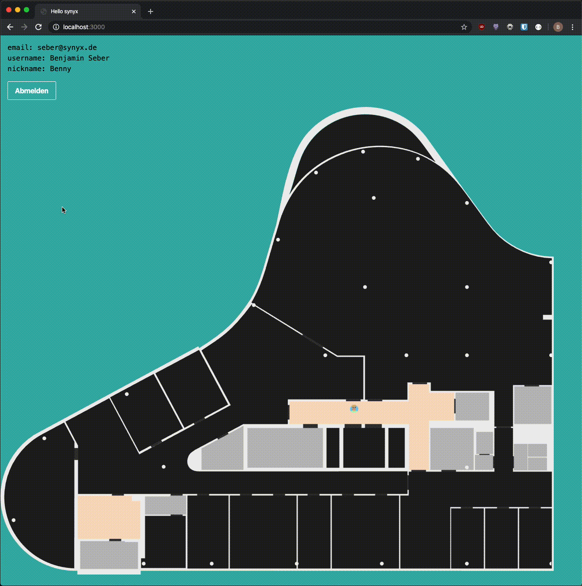

# synyx-remote

spiel, spaß und spannung

## Development

Was du brauchst:

- NodeJS 12
- synyx Internet / aktiver synyx VPN

Wie du startest:

- `npm install`: installiert alle benötigten Dependencies
- `npm run dev`: startet den Server und hört auf Änderungen im Code um ihn neu zu starten

Rufe dann die URL die dir gesagt wird im Browser auf (müsste `http://localhost:3000` sein).

Einloggen kannst du dich mit deinen LDAP Credentials.
